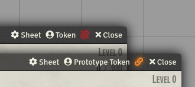

    
# Actor Link Indicator for Foundry VTT
### _Created by: JeansenVaars_

Stop forgetting to link/unlink tokens from actors! Adds an easy to observe, toggle indicator in sheet titles to quickly
switch and identify whether actors produce linked tokens or unlinked prototype tokens, or whether concrete
Tokens are currently linked to their Actor or not.

_Theoretically System Agnostic!_

**Recommended Together with [Window Controls](https://github.com/saif-ellafi/foundryvtt-window-controls)**

[Invite me a coffee if you find this useful :D](https://ko-fi.com/V7V14D3AH)

## Why this module

I thought it was only me, but it turns out I am not alone in overlooking token linking in Foundry :-)
Besides the fact that prototype tokens show a prefix `[Token]` upon opening, I did anyways sometimes overlook,
or forgot that certain actors were producing linked tokens! On top of that, some systems 
use different defaults for different tokens or even sheets, so it becomes confusing at times to figure that out.

With this module, it will be very clear whether a token is an independent prototype or if it is directly an Actor sheet, 
and allows to conveniently take care of that without having to go into token prototype settings or making changes and 
regret it later for overlooking the setting. When opening Actors, it will clearly indicate whether future tokens of this
Actor will be linked or not.

## Disclaimer

This module does not introduce any new functionalities to Foundry. It is purely a convenient shortcut in the User Interface.
It uses native Foundry VTT methods, for which the only updated data in the actors is the "Actor Link" Prototye Token setting. 

## Features

**Indicators:**
* **On Actors:** Indicates whether the Actor will generate linked tokens or prototype tokens
  * Clicking this indicator toggles its link mode. **Only affects new future tokens**
* **On Tokens:** Indicates whether the token is attached to an Actor or if it is an independent unlinked "grunt"
  * **ONE-WAY-UNLINK**: Linked Tokens may go into detached mode and become "grunts", or copies, basically unlinked from 
  an Actor. **Only affects selected token.** Does not go the other way around.
  * This was done on purpose, as the other way around (re-linking a detached token with 1-click) could lead to data-loss.
  The token's data would be replaced by the actual actor's values. Thus, no shortcut was added for relinking.
  You should do that yourself if you know what you are doing :)

## By JeansenVaars

## Check out my other modules!
* Minimal UI
* Scene Preview
* Super Select

# License
[MIT License](./LICENSE.md)

# Powered By

Thanks to JetBrains I can work on this project using **WebStorm**.
